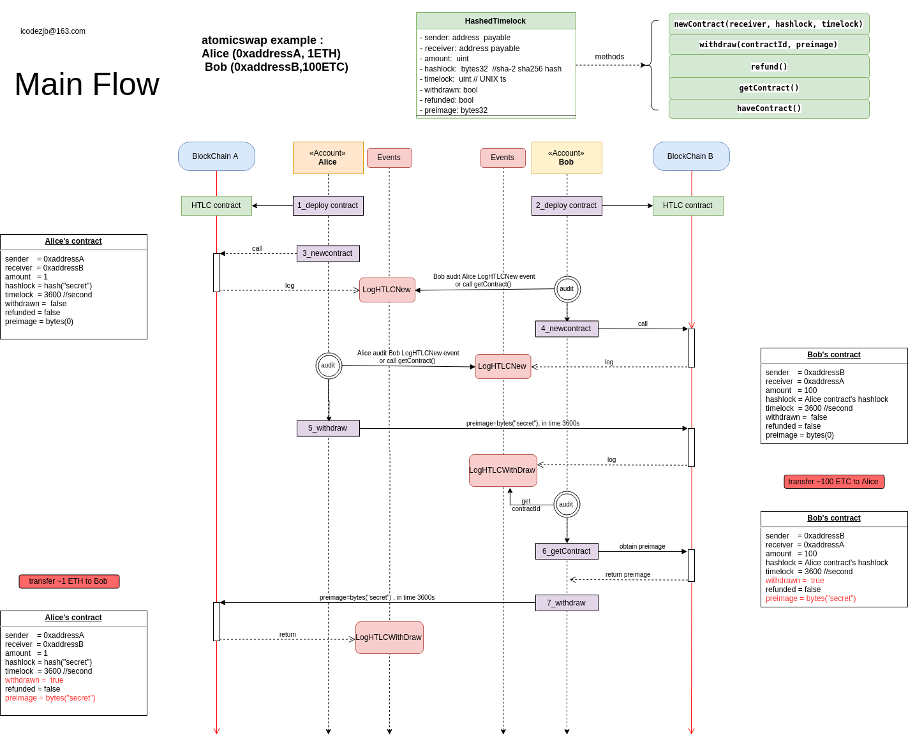

## 基于EVM的跨链原子交换

### 跨链原子交换理论的通俗化解释
跨链原子交换是两个不同区块链资产之间的一笔交易(trade). 例如,一方给另一方的ETH地址转一些ETH,同时另一方给其的ETC地址转一些ETC.然而,不同的区块链之间没有相关性,而且区块链上的交易(transaction)也不能被撤销,这样无法保证在上述的交易(trade)结束前,他们始终遵守他们各自的交易(trade)承诺.解决这个问题的常见方法是引入一个相互信任的第三方进行托管.而跨链原子交换解决了这个问题,但不需要第三方.

原子交换涉及的双方先支付一笔资产在各自链上的智能合约中,该智能合约使得双方都能赎回这笔资产,但赎回的规则对双方是不同的.

资产交换发起方1即initiator先生成一个secret(字符串或数字),然后发送一笔transaction将要交换的资产数量存到智能合约.只要知道secret,智能合约就允许资产交换参与方2即participant赎回合约中的资产.如果一段时间(通常是48小时)内participant没有赎回合约中的资产,那么合约中的资产可以被退回initiator的钱包.

为简单起见,我们假设initiator希望用ETH和participant交换ETC,initiator也可以用ETC和participant交换ETH,步骤相同
,但应注意在哪个区块链上.

participant此时不知道secret,无法赎回initiator在Ethereum合约中的ETH,如果initiator提前向participant透露了secret,participant就可以赎走Ethereum合约中的ETH而不去遵守他们之间的交换承诺.

participant在Ethereum Class上创建一个和initiator相似的智能合约,并将预期的ETC存到Ethereum Class链上的智能合约.此时若要使initiator赎回ETC,initiator必须先向participant透露Ethereum合约的secret.而为了使participant能够创建该智能合约,initiator必须向participant公开其secret的hash,如果participant想退回合约中的ETC,则需要等待initiator设置的timeout的一半时间（通常是24小时）.

各自在各自的链上将资产存到其智能合约中,在他们设置的超时等待时间前,各方都不能退回其存到智能合约中的资产.initiator从Ethereum Class合约赎回ETC,从而向participant透露了secret,然后participant从initiator的赎回交易中提取secret,从而使participant能够赎回initiator存在Ethereum合约中的ETH.

以上例子的过程是原子性的（带有超时）,因为在执行退款前,每一方都至少有24小时去赎回另一条链上合约中的资产.

### atomicswap主要流程



### 构建atomicswap
  需要安装solidity编译器和golang
- `solc: Version: 0.5.10+commit.5a6ea5b1`
  ```bash
  sudo npm install -g solc@0.5.10
  ```

- `golang: go version go1.13.5 linux/amd64`

- `make build`

### 测试atomicswap
```bash
$ make test
go test -v ./cmd/ -run TestHandlerAll_MainFlow
geth path: testing/geth-linux-amd64-1.9.8-d62e9b28
=== RUN   TestHandlerAll_MainFlow
0xae6e5fee5161cede9bc4d89effbbf9944867127d      <===========atomicswap===========>       0x75a8f951632c2e550906f31b53b7923f45be5157
                chain1                                                                                    chain2         
                node1                                                                                     node2
              initiator                                                                                 participant
            100 coin1(wei)                                                                            10000 coin2(wei)

  Test atomicswap between chain1 and chain2 
    atomicswap main follow 
      [1] node1 deploy contract address on chain1 should be 0x12D51a18385542d53acC27011aD27E57115b8e0b ✔✔✔
      [2] node2 deploy contract address on chain2 should be 0x071C14E8f6379c4f1d727fDf833024AE9C73C574 ✔✔✔
      [3] initiator lock 100 coin1 on chain1 0x12D51a18385542d53acC27011aD27E57115b8e0b 
          with hashlock=0x3a9fb66bfb804cc8694c442bf2b18e7a32e4eca03b79c3700d354b4927930105 and timeLockOnChain1 ✔✔
      [4] initiator query the lock tx on chain1 and get the ContractIDOnChain1 ✔✔✔✔✔
      [5] participant audit the contract on chain1 by the ContractIDOnChain1 ✔✔✔✔✔✔✔✔
      [6] participant lock 10000 coin2 on chain2 0x071C14E8f6379c4f1d727fDf833024AE9C73C574 
          with hashlock=0x3a9fb66bfb804cc8694c442bf2b18e7a32e4eca03b79c3700d354b4927930105 and timeLockOnChain2 ✔✔
      [7] participant query the lock tx on chain1 and get the ContractIDOnChain2 ✔✔✔✔✔
      [8] initiator audit the contract on chain2 by the ContractIDOnChain2 ✔✔✔✔✔✔✔✔
      [only for this test] check balance, if not enough, pay some to the other for redeem fee 
        initiator balance on chain1 should be 999999999999999900 ✔
        participant balance on chain1 should be 0 ✔
        initiator balance on chain2 should be 0 ✔
        participant balance on chain2 should be 999999999999990000 ✔
        initiator transfer paySome=7949900000000000 wei to participant on chain1 ✔✔✔
        participant transfer paySome=7949900000000000 wei to initiator on chain2 ✔✔✔
      [9] initiator redeem on chain2 0x071C14E8f6379c4f1d727fDf833024AE9C73C574 with the preimage or secret of hashlock 
        after redeem, initiator balance should be somePay-redeemFee+participantAmount ~ 7871412000010000 ✔
      [10] participant audit the contract on chain2 0x071C14E8f6379c4f1d727fDf833024AE9C73C574 to get the preimage or secret of hashlock ✔✔✔✔✔✔✔✔
      [11] participant redeem on chain1 0x12D51a18385542d53acC27011aD27E57115b8e0b with the preimage or secret of hashlock 
        after redeem, participant balance should be expectBalance=somePay-redeemFee+initiatorAmount ~ 7871412000000100 ✔
      [12] initiator audit the contract on chain1 0x12D51a18385542d53acC27011aD27E57115b8e0b to complete atomic swap ✔✔✔✔✔✔✔✔
      [13] initiator refund on chain1 0x12D51a18385542d53acC27011aD27E57115b8e0b should be fail ✔✔
      [14] participant refund on chain2 0x071C14E8f6379c4f1d727fDf833024AE9C73C574 should be fail ✔✔


68 total assertions

--- PASS: TestHandlerAll_MainFlow (22.21s)
PASS
ok  	github.com/icodezjb/atomicswap/cmd	22.413s

```
